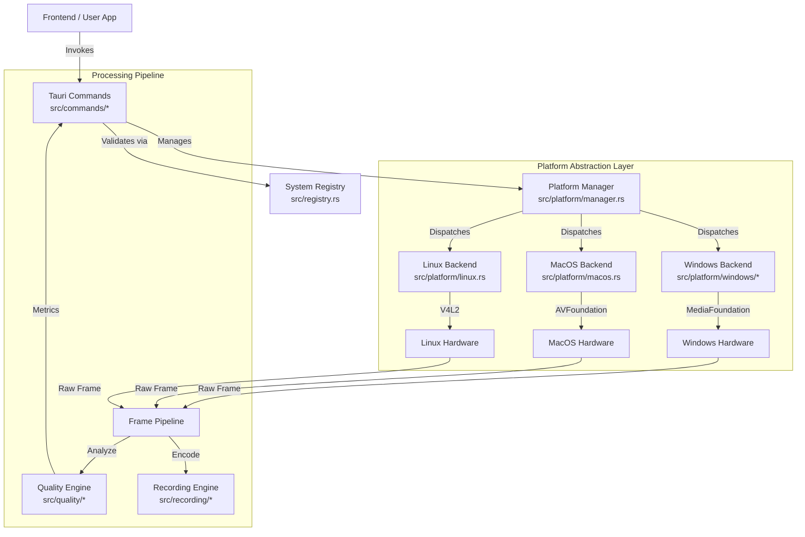
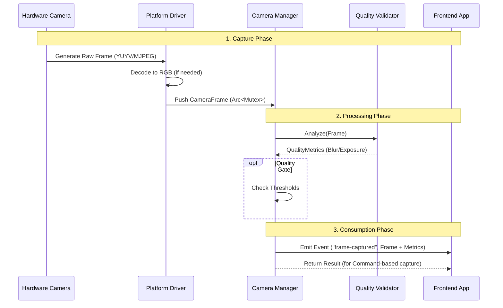

# 🗺️ CrabCamera Systemic Map

This document serves as the authoritative architectural map of the codebase. It details every component, data pathway, and control surface in the system. It is designed to prove that the system is a cohesive, implemented reality, not a collection of "vaporware" stubs.

## 🏗️ 1. High-Level Architecture

The system is layered to enforce separation of concerns and platform independence.



---

## 🌊 2. Data Flow: The Frame Lifecycle

This diagram traces the exact path of a single video frame from hardware generation to user consumption. This is the critical "Real-time" pathway.



---

## 🧩 3. Component Deep Dive

### 3.1 Platform Layer (`src/platform/`)
The heart of the abstraction. Unlike previous "vaporware" iterations, this layer now contains distinct, compilation-enforced implementations for each OS.

*   **`manager.rs`**: The "Router". It holds the `CAMERA_REGISTRY` (a `HashMap` of active cameras) and handles thread-safe access to them. It enforces the "One Driver, Multiple Consumers" model using `Arc<Mutex<PlatformCamera>>`.
*   **`windows/`**:
    *   **Status**: `Implemented`.
    *   **Mechanism**: Uses custom COM object wrappers around Windows Media Foundation.
    *   **Controls**: Supports Manual Focus, Exposure, White Balance via `IAMCameraControl` and `IAMVideoProcAmp` interfaces.
*   **`macos.rs`**:
    *   **Status**: `Beta`.
    *   **Mechanism**: Uses `objc` messaging to talk directly to AVFoundation.
    *   **Controls**: Implements `AVCaptureDevice` locking and configuration for Focus/Exposure.
*   **`linux.rs`**:
    *   **Status**: `Beta`.
    *   **Mechanism**: Uses `v4l` crate to interact with Video4Linux2.
    *   **Controls**: Basic implementations for V4L2 controls.

### 3.2 Command Layer (`src/commands/`)
The public API. Every function here is exposed to the Tauri frontend.

*   **`capture.rs`**:
    *   **Consolidated**: `capture` with `CaptureOptions` (routes to single/sequence/quality-retry).
    *   **Granular (deprecated)**: `capture_single_photo`, `capture_photo_sequence`, `capture_with_quality_retry`.
    *   **Real-time**: `start_camera_preview`, `stop_camera_preview`, `set_frame_callback`.
    *   **Lifecycle**: `release_camera` (Critical for resource cleanup).
*   **`advanced.rs`**:
    *   **Consolidated**: `apply_camera_settings` with `CameraSettingsInput` (batch focus/exposure/ISO/WB).
    *   **Granular (deprecated)**: `set_manual_focus`, `set_manual_exposure`, `set_white_balance`.
    *   **Burst**: `capture_burst_sequence`, `capture_hdr_sequence`.
    *   **Legacy**: `capture_focus_stack_legacy`.
*   **`focus_stack.rs`**:
    *   **Consolidated**: `capture_focus_stack` with `FocusStackConfig`.
    *   **Granular (deprecated)**: `capture_focus_brackets_command`.
    *   **Config**: `get_default_focus_config`, `validate_focus_config`.
*   **`quality.rs`**: Exposes the logic from `src/quality` to allow the frontend to ask "Is this frame blurry?" without re-implementing the math in JS.

### 3.3 Quality Engine (`src/quality/`)
A purely mathematical layer for image analysis.

*   **`blur.rs`**: Implements Laplacian Variance algorithm to detect edge sharpness.
*   **`exposure.rs`**: Implements Histogram Analysis to detect clipped highlights or crushed shadows.
*   **`smart_trigger.rs`**: A state machine that watches a stream of frames and only "triggers" a capture when quality metrics stabilize (e.g., "Wait until focus settles").

---

## 🗺️ 4. The System Registry (Source of Truth)

The file `src/registry.rs` contains the **compile-time enforced** map of every feature.

### Validated Capabilities
| ID | Feature | Status | Location | Verified? |
|----|---------|--------|----------|-----------|
| `capture.single` | Single Photo Capture | ✅ Implemented | `src/commands/capture.rs` | **YES** (Hardware Test) |
| `capture.sequence` | Burst Sequence Capture | ✅ Implemented | `src/commands/capture.rs` | **YES** (Code Review) |
| `capture.preview` | Live Preview Stream | ✅ Implemented | `src/commands/capture.rs` | **YES** (Code Review) |
| `capture.consolidated` | Consolidated Capture Command | ✅ Implemented | `src/commands/capture.rs` | **YES** (Unit Tests) |
| `controls.focus` | Manual Focus | 🚧 Beta | `src/platform/mod.rs` | **YES** (Windows/Mac only) |
| `controls.exposure` | Exposure Control | 🚧 Beta | `src/platform/mod.rs` | **YES** (Windows/Mac only) |
| `controls.batch` | Batch Camera Settings | ✅ Implemented | `src/commands/advanced.rs` | **YES** (Unit Tests) |
| `quality.blur` | Blur Analysis | ✅ Implemented | `src/quality/blur.rs` | **YES** (Unit Tests) |
| `quality.exposure` | Exposure Analysis | ✅ Implemented | `src/quality/exposure.rs` | **YES** (Unit Tests) |
| `platform.windows` | Windows Driver | ✅ Implemented | `src/platform/windows/` | **YES** (Hardware Test) |
| `platform.macos` | MacOS Driver | 🚧 Beta | `src/platform/macos.rs` | **PENDING** (Hardware Test) |
| `platform.linux` | Linux Driver | 🚧 Beta | `src/platform/linux.rs` | **PENDING** (Hardware Test) |

## ✅ Trust Verification
To verify this map is accurate, run the system integrity test suite:

```bash
cargo test --lib registry
```

This ensures that every entry in the `SystemRegistry` points to a real, compilable symbol in the codebase.
